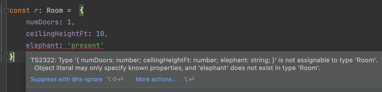
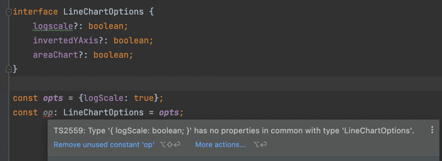

# 잉여 속성 체크의 한계 인지하기

> **타입이 명시된 변수**에 **객체 리터럴**을 할당할 때, 잉여 속성 체크를 수행합니다. 

- 변수가 가진 타입에 할당되는 객체가 실제로 타입이 가진 속성을 모두 가지고 있는지, 그 이외의 추가적인 속성을 가지고 있는지를 체크한다.

```typescript
interface Room {
    numDoors: number;
    ceilingHeightFt: number;
}

const r: Room =  {
    numDoors: 1,
    ceilingHeightFt: 10,
    elephant: 'present'
}
```
- 여기서 `r`이라는 변수가 **타입이 명시된 변수** 이고, = 뒤에 나오는 `{}`이 바로 **객체 리터럴**이다.
- 객체를 선언하는 시점에 해당 변수에 할당되는 것을 볼 수 있다. 즉, 객체 리터럴에 대한 잉여 속성 체크는 객체를 선언하는 시점에 수행된다.

<br/>



- 실제로 위 코드에서 `Room` 인터페이스 내에 존재하지 않는 `elephant` 속성을 변수에 할당하고자 할 때, 오류를 발생시키고 있다.

<br/>
<br/>

> 하지만 구조적 타이핑 관점에서 **객체 리터럴**로 선언된 객체는 잉여 속성을 가질 뿐, `Room` 타입이 가진 속성을 모두 가지고 있기 때문에 `Room` 객체가 될 수 있다고 볼 수 있다.

```typescript
const obj  =  {
    numDoors: 1,
    ceilingHeightFt: 10,
    elephant: 'present'
}

const r: Room = obj;
```

- 위의 설명과 같이, **객체 리터럴**로 선언된 객체 `obj`는 `Room` 타입의 변수 `r`에 할당이 가능하다.

<br/>

두 상황의 차이점을 통해 객체가 선언되는 시점에 잉여 속성 체크가 수행되고, 이후 할당하는 시점에는 이루어지지 않는다는 것이다. 
- 첫 번째에서는 선언하는 시점과 할당하는 시점이 동일하였기 때문에 잉여 속성 체크를 수행하였다.
- 두 번째에서는 타입의 정의 없이 객체가 선언되었고 잉여 속성 체크를 하지 않았다. 할당하는 시점에는 단순히 속성 체크(할당 가능 체크)만 수행하였다.


추가적으로,  
```typescript
interface Options {
    title: string;
    darkMode?: boolean;
}

const o1: Options = document;
const o2: Options = new HTMLAnchorElement;
```

- `document`는 전역객체로, `title`이라는 `string` 타입의 속성을 가지고 있다. 또한 이미 선언되어있는 객체를 할당하기 때문에 할당 가능 체크를 수행하였다.
- `new`연산자를 통해 객체를 생성하였고, 생성된 객체는 `title`이라는 `string` 타입의 속성을 가지고 있다. (실제로 HTMLElement 타입에 존재한다.) 또한 생성된 객체를 할당하기 때문에 할당 가능 체크를 수행하였다.

<br/>  

> 생성하는 시점에 선언되는 것이 아닌가? 라는 생각이 든다면 맞다. 즉, 선언시점에 할당 가능 체크를 수행하기 때문이 아니라 **객체 리터럴**로 명시적으로 선언하였기 때문인 것이다. 결국 **객체 리터럴**을 통한 명시적 선언과 할당이 동시에 이루어졌을 때, 잉여 속성 체크가 발생한다고 볼 수 있겠다.


```typescript

interface Options {
    title: string;
}

const o: Options = {darkMode : true, title:'Ski Free'} // error

const obj2 = {darkMode : true, title:'Ski Free'}
const o2: Options = obj2;
```

- `o`객체와 `obj2` 모두 **객체 리터럴**로 선언되었으나, 선언 시점에 타입 객체로 할당되었는가의 차이에 따라 달라지는 것을 볼 수 있다. 

<br/><br/>

객체 리터럴을 사용하되 잉여 속성 체크를 하지 않으려면 세가지 방법이 존재한다.


#### 1. 타입 단언문 사용

```typescript
interface Options {
    title: string;
}

const o = {darkMode : true, title:'Ski Free'} as Options;
```

- 객체를 선언하고 난 이후에 타입을 지정하는 방식이므로, 선언하는 시점에는 잉여 속성 체크를 하지 않는다.

<br/>

#### 2. 인덱스 시그니처 사용
```typescript
interface Options {
    title: string;
    [otherOptions: string] : unknown;
}

const o: Options = {darkMode : true, title:'Ski Free'};
```

- 인덱스 시그니처를 사용하여 추가적인 속성이 존재한다는 것을 명시, 허용할 수 있다.

<br/>

#### 3. 약한 타입 사용

```typescript
interface LineChartOptions {
    logscale?: boolean;
    invertedYAxis?: boolean;
    areaChart?: boolean;
}

const opts = {logScale: true};
const op: LineChartOptions = opts;
```
- `LineChartOptions`과 같이 Optional 속성만으로 선언된 타입을 약한 타입이라고 한다. 구조적 타이핑 관점에서 약한 타입은 어떠한 객체의 형태든 포함되기 때문에 매우 큰 범위의 타입으로 볼 수 있다. 즉, 타이핑의 의미가 존재하지 않는다.
- TS는 약한 타입에 대해서 잉여 속성 체크, 할당 가능 체크가 아닌 공통된 속성에 대한 체크를 수행한다. 
  - **잉여 속성 체크** - 할당되는 객체가 선언된 모든 속성을 가지고 있는가? + 이외의 속성을 가지고 있지는 않는가?
  - **할당 가능 체크** - 할당되는 객체가 선언된 모든 속성을 가지고 있는가?
  - **공통 속성 체크** - 할당되는 객체가 선언된 속성을 하나라도 가지고 있는가?

<br/>


- 실제로 `opts`객체는 `LineChartOptions`의 속성을 한 개도 가지고 있지 않다. 이로 인해 할당 시점에 오류를 발생시킨다. 


<br/>

### 정리하자면,

#### 1. 잉여 속성 체크는 타입이 명시된 변수에 타입 리터럴을 할당할 때만 발생하며, 오류를 찾는 효과적인 방법이다. 

#### 2. 잉여 속성 체크를 회피하는 할 수 있는 방법은 다양한다.

#### 3. 속성 체크 종류는 다음과 같다.
|               타입 체크 종류               |                        타입 체크 내용                         | 타입 체크 조건                      |
|:------------------------------------:|:-------------------------------------------------------:|:------------------------------|
|               잉여 속성 체크               | - 할당되는 객체가 선언된 모든 속성을 가지고 있는가? <br/> - 이외의 속성을 가지고 있는가? | 타입이 명시된 변수에 **타입 리터럴**을 할당할 때 |   
|               할당 가능 체크               |             - 할당되는 객체가 선언된 모든 속성을 가지고 있는가?              | 타입이 명시된 변수에 객체를 할당할 때         |
|               공통 속성 체크               |            - 할당되는 객체가 선언된 속성을 하나라도 가지고 있는가?             | **약한 타입**이 명시된 변수에 객체를 할당할 때  |

---