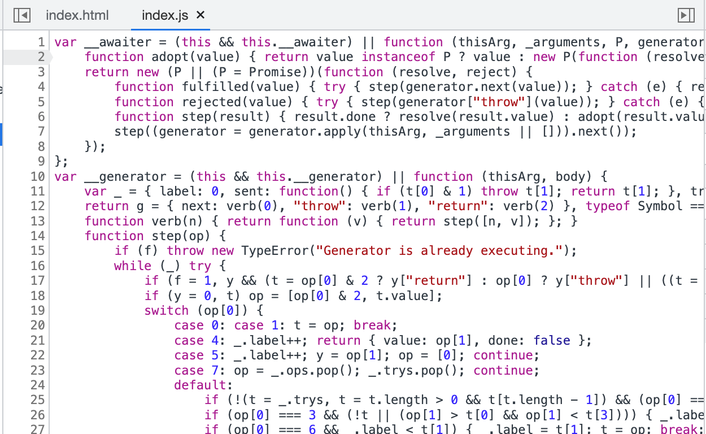
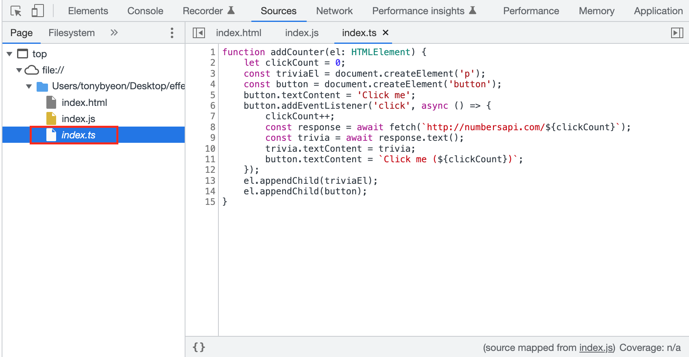

# 아이템 57. 소스맵을 사용하여 타입스크립트 디버깅하기

디버깅은 런타임에 동작한다. 디버깅이 필요한 시점에 타입스크립트가 직접 실행되는 것이 아니다. 따라서 현재 동작하는 코드가 어떤 과정을 거쳐서 만들어진 것인지 알기가 어렵다. **변환된 자바스크립트 코드는 전처리기, 컴파일러, 압축기를 거친 자바스크립트 코드로 복잡해 디버깅하기가 매우 어렵다.**

**디버깅 문제를 해결해기 위해 브라우저 제조사들은 서로 협력하여 소스맵(source map)이라는 해결책을 내놓았다.** 소스맵은 변환된 코드의 위치와 심벌들을 원본 코드의 원래 위치와 심벌들로 매핑한다.

다음 Typescript 코드를 디버깅해보자.

```ts
function addCounter(el: HTMLElement) {
    let clickCount = 0;
    const triviaEl = document.createElement('p');
    const button = document.createElement('button');
    button.textContent = 'Click me';
    button.addEventListener('click', async () => {
        clickCount++;
        const response = await fetch(`http://numbersapi.com/${clickCount}`);
        const trivia = await response.text();
        trivia.textContent = trivia;
        button.textContent = `Click me (${clickCount})`;
    });
    el.appendChild(triviaEl);
    el.appendChild(button);
}
```

오래된 브라우저에서 async와 await를 지원하기위해 타입스크립트는 이벤트 핸들러를 상태 머신으로 재작성한다. 원본 코드하고 동일하게 동작하지만 이해하기가 어렵다.



sourcemap 옵션을 켜서 컴파일을 실행하면, .js 와 .js.map 두개의 파일이 생성된다.

```sh
tsc index.ts --sourcemap true
```

sourcemap 파일을 생성한다면, 브라우저에서 Typescript로 디버깅이 가능하다.



디버거 좌측 파일 목록에서 index.ts가 기울임(이탤릭) 글꼴로 나오는 것을 확인할 수 있다. 기울임 글꼴은 웹 페이지에 포함된 '실제' 파일이 아니라는 것을 뜻한다. **실제로는 소스맵을 통해 타입스크립트처럼 보이는 것뿐이다.**

### 주의사항

- 타입스크립트와 함께 번들러나 압축기를 사용하고 있다면, **번들러나 압축기가 각자의 소스맵을 생성하므로 설정을 한번 더 확인하자.**
- **상용 환경에 소스맵이 유출되고 있는지 확인하자.** 디비거를 열지 않으면 소스맵이 로드되지 않으므로, 실제 사용자에게 **성능 저하는 발생하지 않는다.** 그러나 중요한 인라인 복사본이 포함되어 있다면 공개해서는 안된다.
- **NodeJS 프로그램의 디버깅에도 소스맵을 사용할 수 있다.**
- **타입 체커가 코드를 실행하기 전에 많은 오류를 잡을 수 있지만, 디버거를 대체할 수 없다.**


### 요약

- 원본 코드가 아닌 변환된 자바스크립트 코드를 디버깅하지 말자. 소스맵을 사용해서 런타임에 타입스크립트 코드릴 디버깅하자.
- 소스맵이 최종적으로 변환된 코드에 완전히 맵핑되었는지 확인하자.
- 소스맵에 원본 코드가 그대로 포함되도록 설정되어 있을 수 있다. 소스맵이 공개되지 않도록 설정을 확인하자.