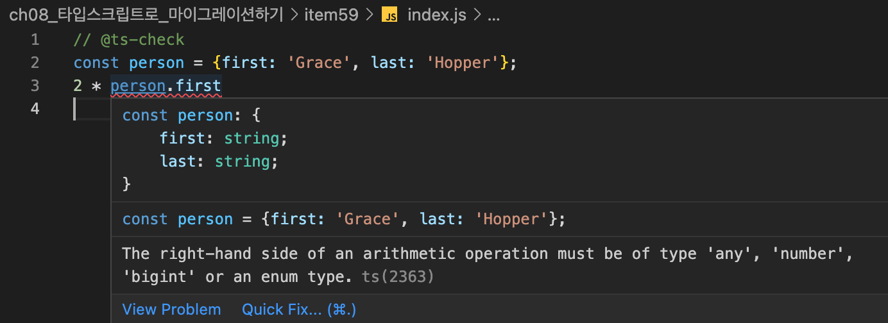
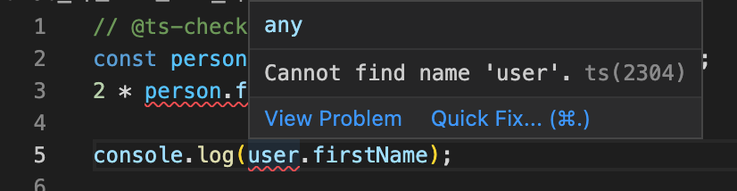
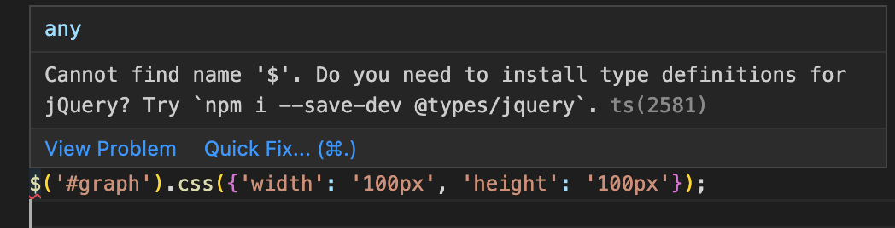
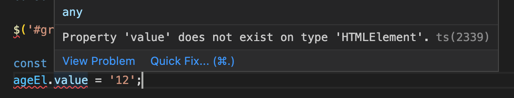

# 아이템 59. 타입스크립트 도입 전에 @ts-check와 JSDoc으로 시험해 보기

### `@ts-check`

`@ts-check` 지시자를 사용하면 타입스크립트 전환시에 어떤 문제가 발생하는지 미리 시험해 볼 수 있다. `noImplicityAny` 설정을 해제한 것보다 느슨한 검사를 수행한다.

```js
// @ts-check
const person = {first: 'Grace', last: 'Hopper'};
2 * person.first
```



`person.first`의 타입은 string으로 추론되었고, `2 * person.first`는 타입 불일치 오류가 발생했다.

#### 선언 되지 않은 전역 변수



어딘가에 선언되어 있는 전역 변수의 경우 `types.d.ts` 파일에 별도로 정의 해주어야 한다.

```ts
interface UserData {
    firstName: string;
    lastName: string;
}
declare let user: UserData;
```

이후 '트리플 슬래시' 참조를 사용하여 명시적으로 임포트하면 오류가 해결된다.

```js
/// <reference path="./types.d.ts" />
console.log(user.firstName)
```

#### 알 수 없는 라이브러리

```js
// @ts-check
$('#graph').css({'width': '100px', 'height': '100px'});
```



알 수 없는 라이브러리의 경우 라이브러리에 맞는 타입 선언을 설치하면 설치한 타입 선언을 참조하게 된다.

```sh
npm install --save-dev @types/jquery
```

#### DOM 문제 

```js
const ageEl = document.getElementById('age');
ageEl.value = '12';
```



DOM 관련 오류의 경우 `JSDoc`을 사용해서 해결할 수 있다. 

```js
const ageEl = /** @type {HTMLInputElement} */ (document.getElementById('age'));
ageEl.value = '12';
```

#### 부정확한 JSDoc

프로젝트에서 이미 JSDoc 스타일의 주석을 사용중이었다면, `@ts-check` 지시자를 설정하는 순간부터 기존 주석에 타입 체크가 동작하게 되고 갑자기 수많은 오류가 발생하게 된다. 이때는 당황하지 말고 타입 정보를 차근차근 추가해 나가면 된다.

`@ts-check` 지시자와 JSDoc 주석을 너무 장기간 사용하는 것은 좋지 않다. 주석이 코드 분량을 늘려서 로직을 해석하는데 방해가 될 수 있다. **마이그레이션의 궁극적인 목표는 자바스크립트에 JSDoc 주석이 있는 형태가 아니라 모든 코드가 타입스크립트 기반으로 전환되는 것임을 잊지 말아야 한다.**

### 요약

- 파일 상단에 `// @ts-check`를 추가하면 자바스크립트에서도 타입 체크를 수행할 수 있다.
- 전역 선언과 서드파티 라이브러리의 타입 선언을 추가하는 방법을 익히자.
- JSDoc 주석을 잘 활용하면 자바스크립트 상태에서도 타입 단언과 타입 추론을 할 수 있다.
- JSDoc 주석은 중간 단계이기 떄문에 너무 공들이지 말자. **최종 목표는 .ts로 된 타입스크립트 코드임을 명심하자.**
