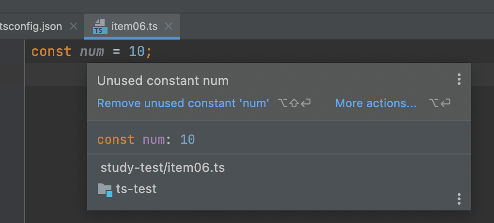
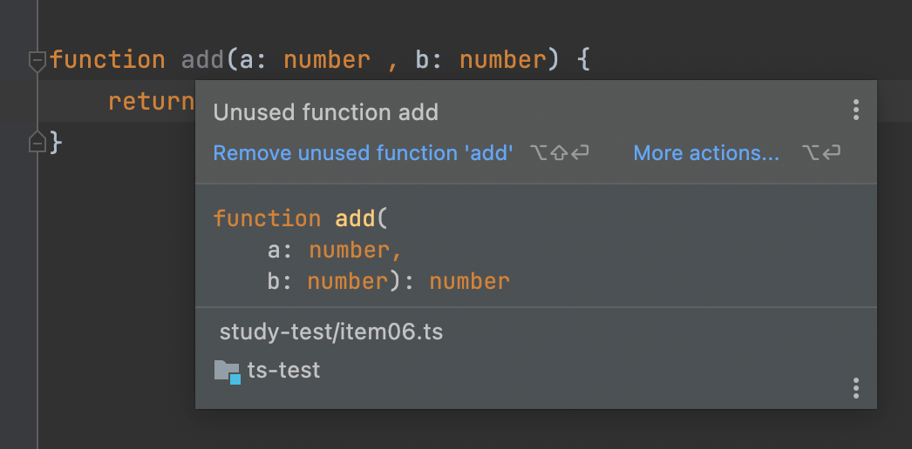
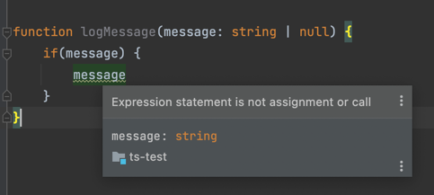
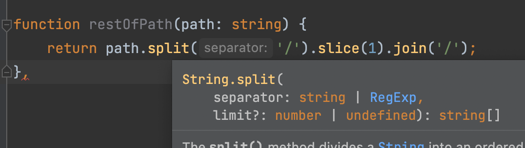
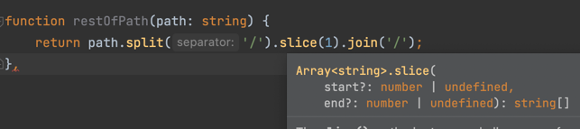
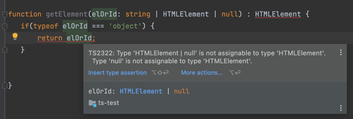
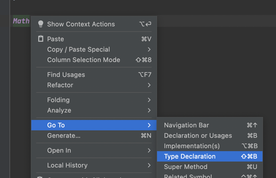

## 편집기를 사용한 타입 시스템 탐색

> TS는 JS를 변환하는 역할도 하지만, 가장 중요한 역할은 타입 시스템에 있습니다.

&nbsp;&nbsp;타입 시스템은 TSC(타입스크립트 컴파일러)를 통해서 TS를 JS로 컴파일 하는 작업이 주요 목적이지만 코드 자동완성, 검색, 리팩토링 등의 언어 서비스 또한 제공한다.
편집기는 이 언어 서비스를 통해서 개발 단계에서 가이드를 제공하고 있다.

#### 1. 변수의 타입 추론

  

- 책에서는 값을 통해 number로 추론하는 것으로 되어있었으나, intelij는 걍 값을 보여준다.

<br/><br/>


#### 2. 함수의 반환값 추론

```typescript
function add(a: number , b: number) {
    return a + b;
}
```

  

- 파라미터와 연산자의 유형에 따라 자동으로 추론하여 반환값이 number로 가이드 하고 있다.

<br/><br/>


#### 3. 분기에서의 타입 추론

> 특정 시점에 TS가 값의 타입을 어떻게 이해하고 있는지 살펴보는 것은 타입 확장과 축소의 개념을 위해 반드시 필요한 과정입니다.



- 실제로 if 분기를 통해 message의 존재여부를 판단하였고, 블럭 내부의 message의 타입은 null이 제외된 string인 것을 볼 수 있다.

<br/><br/>


#### 4. 메서드 체인에서의 타입 추론

> 메서드 체인에서의 값 추론은 해당 메서드의 이름을 조사하면 됩니다.



- path는 string타입으로, String의 메서드인 split을 호출할 수 있다. 그리고 반환값은 string 배열의 타입을 가진다. 
- _string vs String : string은 primitive 타입으로, __'값'__ 으로 존재하는데 __'값'__ 은 메서드를 가질 수 없다. 그러므로 메서드를 사용하기 위해서 String __객체__ 로 변환하여 메서드를 호출하는 방식으로 수행된다. 이 때 사용되는 객체를 __wrapper객체__ 라고 한다._ 

<br/>



- 하나 더 보자면, 위의 split의 반환값은 string 배열이고, Array의 메서드인 slice를 호출할 수 있다.

<br/><br/>

#### 5. 편집기 오류를 통한 타입 추론

> 편집기 상의 타입 오류를 살펴보는 것도 타입 시스템의 성향을 파악하는데 좋은 방법입니다.



- function 내의 분기는 HTMLElement 타입만을 처리할 의도로 사용되었다. TS가 아니었다면 null의 타입 또한 object인지 몰랐을 것이다.

<br/><br/>

#### 6. Go to Definition을 통한 타입 추론

> 언어 서비스는 라이브러리와 라이브러리의 타입 선언을 탐색할 때 도움이 됩니다.
 

&nbsp;&nbsp;라이브러리는 `.d.ts` 파일에 해당 라이브러리가 사용하는 타입을 선언해둔다. `.d.ts` 파일은 JS로 컴파일 되지 않고 단순히 타입을 선언하기 위해서만 존재한다. 언어 서비스는 편집기가 파일에서 선언된 타입을 참조하여 가이드 할 수 있도록 돕는 역할을 수행한다.
뇌피셜로 `d`는 declare이다. 
```typescript
const num = Math.abs(3);
```



- 편집기의 기능을 활용하여 Math가 선언된 라이브러리와 Math의 타입을 확인할 수 있다. 실제로 클릭해보면 `lib.es5.d.ts` 파일 내에 형식이 선언되어있다. 


```typescript
interface Math {
    /** The mathematical constant e. This is Euler's number, the base of natural logarithms. */
    readonly E: number;
    /** The natural logarithm of 10. */
    readonly LN10: number;
    /** The natural logarithm of 2. */
    readonly LN2: number;
    /** The base-2 logarithm of e. */
    readonly LOG2E: number;
    /** The base-10 logarithm of e. */
    readonly LOG10E: number;
    /** Pi. This is the ratio of the circumference of a circle to its diameter. */
    readonly PI: number;
    /** The square root of 0.5, or, equivalently, one divided by the square root of 2. */
    readonly SQRT1_2: number;
    /** The square root of 2. */
    readonly SQRT2: number;
    /**
     * Returns the absolute value of a number (the value without regard to whether it is positive or negative).
     * For example, the absolute value of -5 is the same as the absolute value of 5.
     * @param x A numeric expression for which the absolute value is needed.
     */
    abs(x: number): number;
    /**
     * Returns the arc cosine (or inverse cosine) of a number.
     * @param x A numeric expression.
     */
    acos(x: number): number;
    /**
     * Returns the arcsine of a number.
     * @param x A numeric expression.
     */
    asin(x: number): number;
    /**
     * Returns the arctangent of a number.
     * @param x A numeric expression for which the arctangent is needed.
     */
    atan(x: number): number;
    /**
     * Returns the angle (in radians) from the X axis to a point.
     * @param y A numeric expression representing the cartesian y-coordinate.
     * @param x A numeric expression representing the cartesian x-coordinate.
     */
    atan2(y: number, x: number): number;
    /**
     * Returns the smallest integer greater than or equal to its numeric argument.
     * @param x A numeric expression.
     */
    ceil(x: number): number;
    /**
     * Returns the cosine of a number.
     * @param x A numeric expression that contains an angle measured in radians.
     */
    cos(x: number): number;
    /**
     * Returns e (the base of natural logarithms) raised to a power.
     * @param x A numeric expression representing the power of e.
     */
    exp(x: number): number;
    /**
     * Returns the greatest integer less than or equal to its numeric argument.
     * @param x A numeric expression.
     */
    floor(x: number): number;
    /**
     * Returns the natural logarithm (base e) of a number.
     * @param x A numeric expression.
     */
    log(x: number): number;
    /**
     * Returns the larger of a set of supplied numeric expressions.
     * @param values Numeric expressions to be evaluated.
     */
    max(...values: number[]): number;
    /**
     * Returns the smaller of a set of supplied numeric expressions.
     * @param values Numeric expressions to be evaluated.
     */
    min(...values: number[]): number;
    /**
     * Returns the value of a base expression taken to a specified power.
     * @param x The base value of the expression.
     * @param y The exponent value of the expression.
     */
    pow(x: number, y: number): number;
    /** Returns a pseudorandom number between 0 and 1. */
    random(): number;
    /**
     * Returns a supplied numeric expression rounded to the nearest integer.
     * @param x The value to be rounded to the nearest integer.
     */
    round(x: number): number;
    /**
     * Returns the sine of a number.
     * @param x A numeric expression that contains an angle measured in radians.
     */
    sin(x: number): number;
    /**
     * Returns the square root of a number.
     * @param x A numeric expression.
     */
    sqrt(x: number): number;
    /**
     * Returns the tangent of a number.
     * @param x A numeric expression that contains an angle measured in radians.
     */
    tan(x: number): number;
}
/** An intrinsic object that provides basic mathematics functionality and constants. */
declare var Math: Math;
```
- Math의 선언의 전문이다. 각 메서드와 프로퍼티에 대한 타입이 정의되어있는 것을 볼 수 있다.
- 숨겨진 기능과 속성들을 알 수 있으며, 올바르게 메서드를 사용할 수 있도록 돕고 있다. 

<br/>

### 정리하자면,

#### 1. 편집기는 TS가 제공하는 언어 서비스를 통해서 개발 단계에서 가이드를 제공하고 있다.

#### 2. 라이브러리의 형식이 선언된 `.d.ts` 파일을 통해서 해당 라이브러리의 기능을 명확히 파악할 수 있다. 

---

<br/>
<br/>