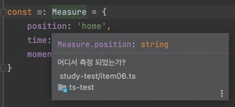
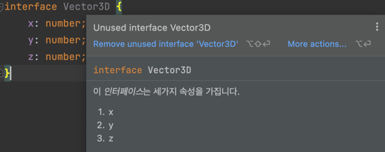

# API 주석에 TSDoc 사용하기

```typescript
// 이 함수는 완전 개꿀입니다.
function gaekkul(): string {
    return 'wow';
}


/* 이 함수는 완전 개꿀입니다. */
function gaekkul2(): string {
    return 'wow';
}
```
- 인라인 형태의 주석이나 JSDoc 스타일 주석 모두 커서를 통해 편집기의 툴팁에 의해 보여진다

<br/>

#### 함수의 경우, JSDoc의 스타일과 같이 `@param`, `@returns`의 데코레이터를 활용하여 인자와 반환값에 대한 가이드를 작성할 수 있다.

```typescript
/**
 * 인사말을 생성한다.
 * @param name 이름
 * @param title 그사람의 칭호
 * @returns 인사말
 */
function greetFullTSDoc(name: string, title: string) {
    return `Hello ${title} ${name}`;
}
```

- 함수 위에서 `/**`만 작성하고 `Enter`를 누르면 intellij가 자동으로 인자와 반환값에 대한 JSDoc을 생성하여 준다.

<br/>

#### 타입을 정의할 때에도 각 속성에 대해서 주석을 입력할 수 있다. 

```typescript
interface Measure {
    /* 어디서 측정 되었는가? */
    position: string;
    time: number;
    /* 측정된 운동량 */
    momentum: string;
}

const m: Measure = {
    position: 'home',
    time: 2022,
    momentum: 'heavy'
}
```

- 아래와 같이 각 속성에 대한 주석이 편집기의 툴팁에 의해 보여진다.




<br/>
<br/>

#### markdown 형식을 사용하므로 문법을 그대로 사용할 수 있다.

```typescript
/**
 * 이 *인터페이스*는 **세가지 속성**을 가집니다.
 * 1. x
 * 2. y
 * 3. z
 */
interface Vector3D {
    x: number;
    y: number;
    z: number;
}
```



<br/>
<br/>


### 정리하자면,

#### 1. 함수, 클래스, 타입에 대해서 주석을 달 때에는 TSDoc 형식을 사용하여 편집기의 툴팁에 의해 주석이 보여지도록 하자.

#### 2. 타입에 대한 명시는 코드로 제공되기 때문에 주석에는 타입에 대한 정보는 명시해서는 안된다.

 